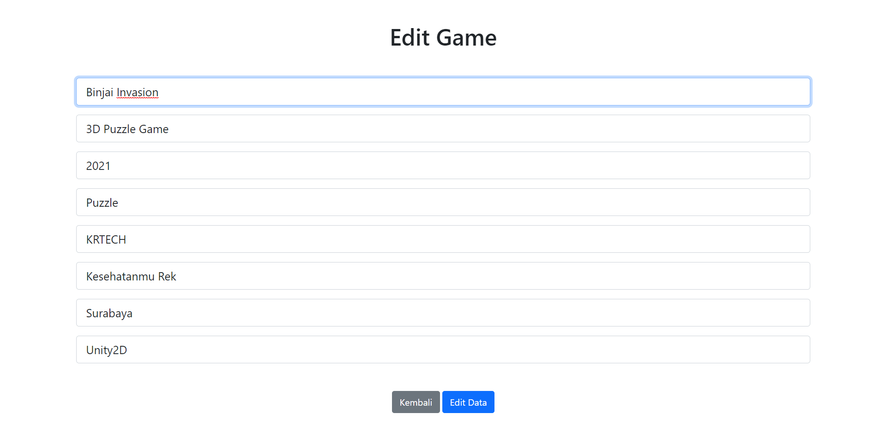
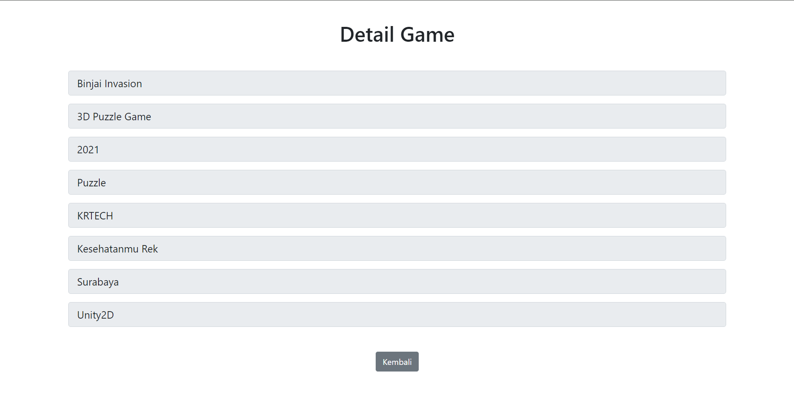

# Tugas-dan-Challenge-PBKK
Pengerjaan tugas sekaligus challenge untuk materi CRUD di kelas PBKK B

# Deskripsi
Direktori Tugas-CRUD: Challenge PBKK yang berisikan interkoneksi 2 tabel, yaitu tabel Studio dan Game yang memiliki relasi one-to-many.
Direktori Produk-CRUD: Tugas PBKK yang berisikan study case CRUD dalam kasus produk yang berisikan field judul, kategori, harga, stock, dan penjual.

# Hasil Produk-CRUD (Tugas PBKK)
## List Page

## Edit Page

## Detail Page

## Hapus Produk (Destroy)

## Tambah Produk

## Halaman phpMyAdmin Produk

# Hasil Tugas-CRUD (Challenge PBKK)
## List Page

## Edit Page

## Detail Page

## Tambah Game (Multiple/Bisa lebih dari satu)

## Tambah Game dan Studio Baru/Update

## Tambah Game dan Studio (Multiple)

## Halaman phpMyAdmin Game

## Halaman phpMyAdmin Studio

